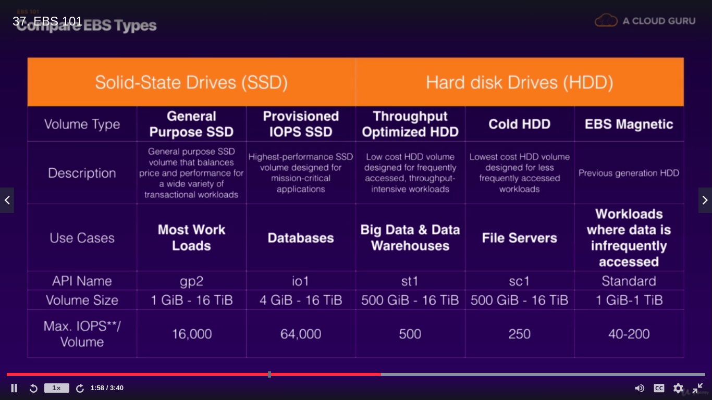

EC2(Elastic compute cloud)

EC2 provides web based virtual machine computing and resizable
Amazon machine image(AMI)

Connect to machine
chmod 400 ~/aws/sada_aws_key.pem
ec2-54-208-121-141.compute-1.amazonaws.com
ssh -i "/home/sadashiv/aws/sada_aws_key.pem" ec2-user@ec2-54-208-121-141.compute-1.amazonaws.com

Windows
https://chrome.google.com/webstore/detail/secure-shell-app/pnhechapfaindjhompbnflcldabbghjo?hl=en
chrome://apps/

IOPS(Input Output per second)
In storage Root device volume can be encrypted

Termination protection is turned off by default, you must turn it on.
On EBS-backed instance, the default action is for the Root EBS volume to be deleted when the instance is terminated.
Additional volume won't be deleted by default.
EBS Root volumes of your default AMI's can be encrypted. you can also use a third party tool(such as bitlocker etc) to encrypt the
root volume, or this can be done when creatin AMI's(lab to fallow) in the AWS console or using the API.

All inbound traffic is blocked by default
All outbound traffic is allowed
Changed to security groups take effect immediately
You can have any number of EC2 instances within a security group
You can have multiple security groups attached to EC2 instances
Secuirty groups are STATEFUL

If you create and inbound rule allowing traffic in, that traffic is automatically allowed back out again.
You cannot block speicifc IP Addresses using security groups, instead use network Access control Lists
You can specify allow rules, but not deny rules.

Amazon Elastic block storage(EBS)
5 different types of EBS storage
- General purpose SSD
- Provisoned IOPS SSD
- Throughput optimized HDD
- Cold HDD
- EBS magnetic

